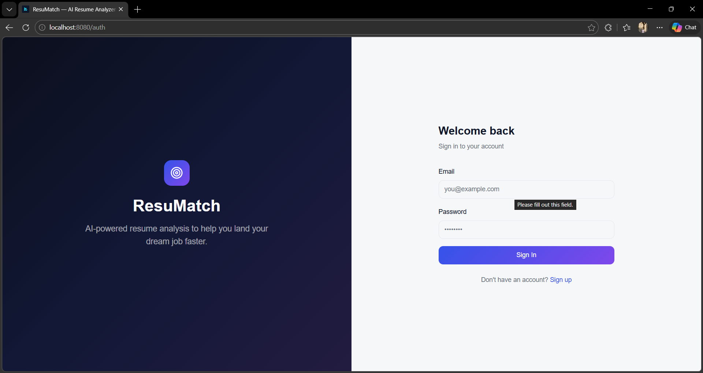
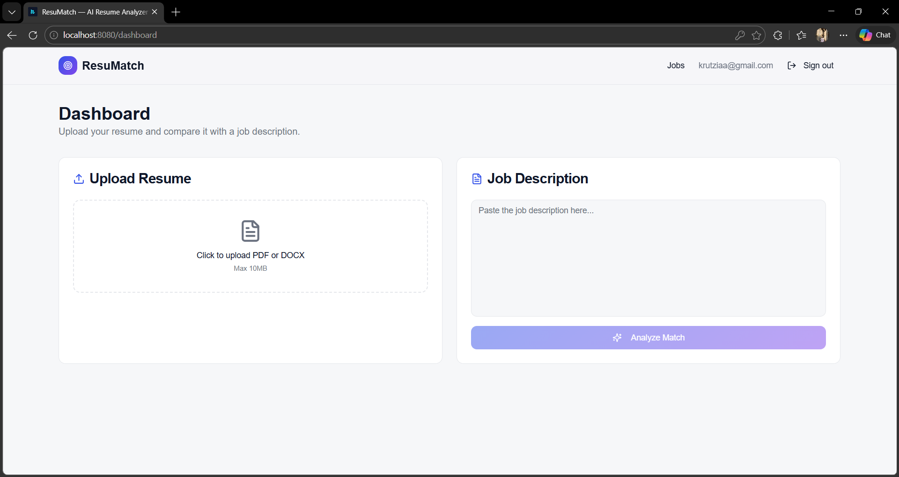

## ResuMatch – AI-Powered Resume & Job Matcher

ResuMatch is a small app I’m building to make it easier to understand how well your resume fits a specific job, and to discover good job matches based on your skills.

You upload your resume (PDF or DOCX), paste in a job description, and the app:

- Gives you a **match score** before and after optimization  
- Shows **missing skills and important keywords**  
- Suggests an **optimized version of your resume**  
- Explains **what changed and why** using AI insights  
- Surfaces **recommended jobs** from different sources with their own match scores  

---

## Features

- **AI resume analysis**
  - Upload your resume (PDF/DOCX) with basic validation
  - Compare resume vs. job description using an AI model
  - See a match score before and after optimization
  - Get concrete suggestions and a side‑by‑side comparison
  - Download the optimized resume text

- **Job recommendations**
  - Fetch jobs through a Supabase Edge Function (`fetch-jobs`)
  - Each job gets a match score plus matched/missing skills
  - Filter by match %, location, work type, experience level, and source
  - Quick apply links and a simple “saved job” toggle (local for now)

- **Accounts and dashboard**
  - Email/password auth via Supabase Auth
  - Protected dashboard and jobs pages
  - Analyses are stored so they can be reused later

- **Modern UI**
  - React + Vite + TypeScript
  - shadcn-ui + Radix UI + Tailwind CSS
  - Framer Motion for subtle animations

---

## Screenshots

### Landing Page


### Authentication


### Dashboard


### AI Analysis


### Resume Comparison


### Optimized Resume Download


---

## Tech stack

- **Frontend**
  - React 18 + TypeScript
  - Vite
  - React Router
  - Tailwind CSS, shadcn-ui, Radix UI, Framer Motion
  - TanStack Query for data fetching and caching

- **Backend / infra**
  - **Supabase**
    - Auth (email/password)
    - Postgres (resumes, analyses, jobs, etc.)
    - Storage (resume files)
    - Edge functions:
      - `analyze-resume` – calls an AI provider to score/optimize resumes
      - `fetch-jobs` – fetches and scores jobs against resume skills
  - External AI provider configured via `AI_API_KEY` on the Supabase side

---

## Getting started

### Prerequisites

- **Node.js** (LTS recommended) and **npm**
- A **Supabase project** with:
  - `SUPABASE_URL`
  - `SUPABASE_ANON_KEY`
- In Supabase Edge Functions, configure:
  - `SUPABASE_SERVICE_ROLE_KEY`
  - `AI_API_KEY` (for the AI model used in `analyze-resume`)

### 1. Clone & install

```bash
git clone <YOUR_GIT_URL>
cd ai-powered-resume-and-jobmatcher
npm install
```

### 2. Configure environment (frontend)

Create a `.env` file in the project root (not committed to Git) and set at least:

```bash
VITE_SUPABASE_URL=<your-supabase-url>
VITE_SUPABASE_ANON_KEY=<your-supabase-anon-key>
```

Make sure these match the Supabase project where your database, storage, and edge functions live.

### 3. Configure Supabase edge functions

In your Supabase project:

- Deploy the functions from the `supabase/functions` directory:
  - `analyze-resume`
  - `fetch-jobs`
- Set environment variables for each function:
  - `SUPABASE_URL`
  - `SUPABASE_ANON_KEY`
  - `SUPABASE_SERVICE_ROLE_KEY`
  - `AI_API_KEY`

Also apply the SQL migrations under `supabase/migrations` to create the required tables (e.g. `resumes`, `analyses`, any job tables if present).

### 4. Run the app locally

```bash
npm run dev
```

Open the URL printed in the terminal (typically `http://localhost:5173`) and:

1. Sign up via the Auth page  
2. Upload a resume on the Dashboard  
3. Paste a job description and run an analysis  
4. View recommended jobs on the Jobs page  

### 5. Run tests

```bash
npm test
```

---

## Project structure (high level)

```text
src/
  main.tsx           # App bootstrap
  App.tsx            # Routes & layout
  pages/
    Index.tsx        # Marketing/landing page
    Auth.tsx         # Login / signup
    Dashboard.tsx    # Resume upload & analysis
    Jobs.tsx         # Job recommendations & filters
  components/
    AIInsightsPanel.tsx
    ATSScoreImpact.tsx
    ResumeComparison.tsx
    ScoreCircle.tsx
    SkillBadge.tsx
    DownloadResumeButton.tsx
    ui/              # shadcn-ui components
  integrations/
    supabase/
      client.ts      # Supabase client config
      types.ts       # Generated types (if any)

supabase/
  functions/
    analyze-resume/  # AI analysis edge function
    fetch-jobs/      # Job fetch & scoring
  migrations/        # Database schema & migrations
```

---

## Live Demo

Try the app here:  
https://ai-powered-resume-and-jobmatcher.vercel.app

---

## Author

Kashish  
B.Tech Computer Science  
JSS Academy of Technical Education, Noida
